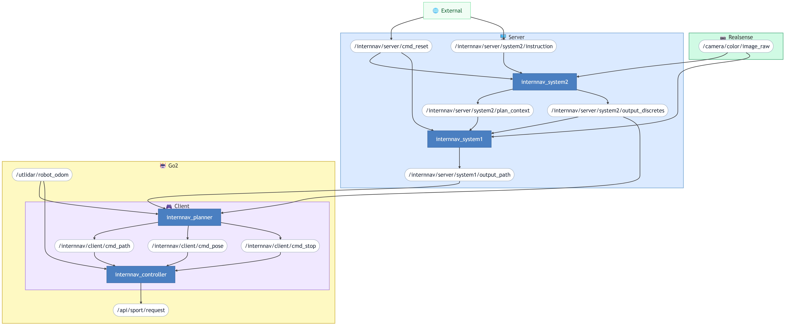

# InternVLA-N1 Real-world Reproduce for Go2 (ROS 2)

ROS 2 deployment of [InternVLA-N1](https://github.com/InternRobotics/InternNav) on the Unitree Go2 Edu robot.  
The original unified DualVLN model is split into two cooperative inference systems: System2 handles vision-language navigation reasoning, and System1 generates continuous trajectories via a TensorRT-optimized diffusion policy.  
A separate client workspace runs on the robot and executes real-time motion control at 100 Hz.

## System Requirements

| | Server | Robot |
|--|--------|-------|
| **Device** | PC | Unitree Go2 Edu |
| **OS** | Ubuntu 22.04 | Ubuntu 20.04+ |
| **ROS 2** | Humble | Foxy |
| **GPU** | 2× RTX 3090 | — |

- Tested with ROS 2 Foxy (robot) and Humble (server).
    - Cross-distro communication is handled by zenoh-bridge-ros2dds.
- System2 (VLN inference) is the more GPU-intensive component and runs on a dedicated GPU (cuda:1).
    - The System1 TensorRT engine (cuda:0) has lower VRAM requirements.

## Architecture

Server and robot communicate over the network via zenoh-bridge-ros2dds, which bridges the ROS 2 topic layer across machines and distros.

## Workspaces

| Workspace | Description |
|-----------|-------------|
| [`interfaces_ws`](interfaces_ws/README.md) | Custom ROS 2 message definitions — see for message types and topic details |
| [`server_ws`](server_ws/README.md) | GPU inference — VLN understanding (System2) and trajectory generation (System1) |
| [`client_ws`](client_ws/README.md) | Real-time robot control — path planning and motion execution on Go2 |

## Getting Started

See each workspace README for setup and launch instructions:

1. [`server_ws/README.md`](server_ws/README.md) — server setup, model preparation, build, and launch
2. [`client_ws/README.md`](client_ws/README.md) — robot setup, build, and launch

## Acknowledgements

This project is based on [InternNav](https://github.com/InternRobotics/InternNav) by Intern Robotics.
The original codebase has been adapted from an HTTP/multi-threaded architecture to a ROS 2 architecture for real-world deployment on the Unitree Go2.

## License

This project is licensed under the Apache 2.0 License. See [LICENSE](LICENSE) for details.
